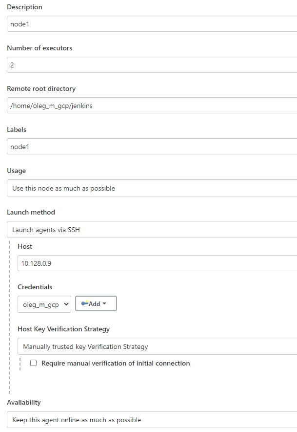
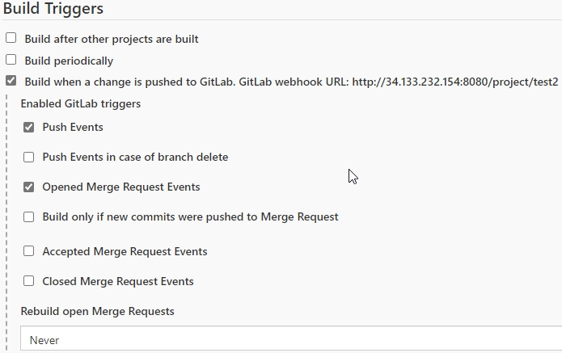
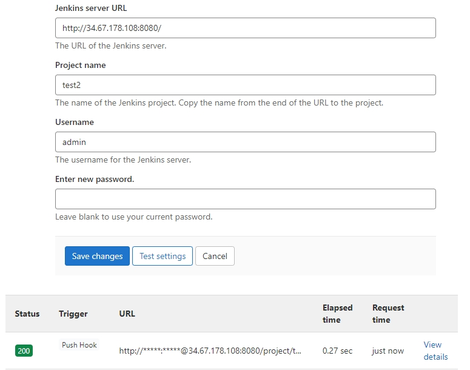
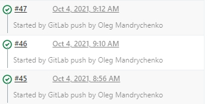
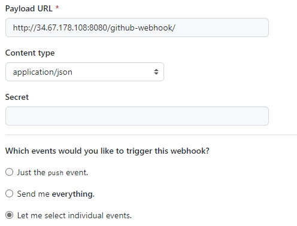
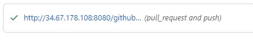
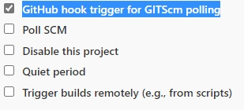

# Task GCP-Jenkins

## Task 1 

## Main goals.
* Create two VM's (Master and node)
* Install Jenkins on Master, connect static slave node
* Create declarative job
* Add parameter environment
* Add Trigger on push and pull-request
* Add `skip build` if commit message is "SKIP_CI"
* Create zip file with suffix $BRANCH_NAME and store it like artifact and build_number
* Create shared library to send slack notification with build status
* Make parallel ping 3 different servers and if ping failed - stop the job
* Move all logic to shared library

--------------------------------------

## Solution

### 0. Prepare working environment. Create working container with cloud-sdk + terraform

```
# Start container
docker run -it --rm -v ${PWD}:/work -w /work ansible-container:v1
```

### 1. Create 2 VM's (Master, node) and pre-install Jenkins. Connect slave Node.

```
# 2 provisioned VM's with pre-istall scripts in ./main.tf file.
# Pre-install startup script in ./startup.sh file.
# Pre-install startup for node in ./startupnode.sh file.
# Connect to Slave Node via SSH:
- make ssh-keygen on master
- copy public key to slave node to path ~/.ssh/authorized_keys
- add needed values in node connection UI (picture below)
- add private key to credentials in node connection UI for connection.
```



### 2. Create declarative job. With:

* Parameter environment
* Making .zip artifact
* Skip build option if have target pattern `SKIP_CI` in commit 
* Parallel ping
* "Build-number" tag to last commit after success build

```
# Jenkins Pipeline in ./Jenkins file
```

### 3. Add GitLab/GitHub Webhook

```
### GitLab ###
1. Install Gitlab plugin in jenkins and restart.
2. In `job` configuration activate GitLab Build trigger. (pic 2)
3. Add Jenkins integration in project repo. (pic 3)
4. Test connection and test push event in repo for Webhook trigger. (pic 4)
```







```
### GitHub ###
1. Add webhook in GitHub project setting with jenkins server URL (pic 5,6)
2. Check `GitHub hook trigger for GITScm polling` (pic 7)
```







### 4. Add slack shared library

* Install `Slack notification plugin` in Jenkins
* create ./vars folder and create slack notification .groovy file
* Add library into pipeline
* Add `post` step in the end of pipeline file.

### 5. Move pipeline logic to shared library

...

--------------------------------------